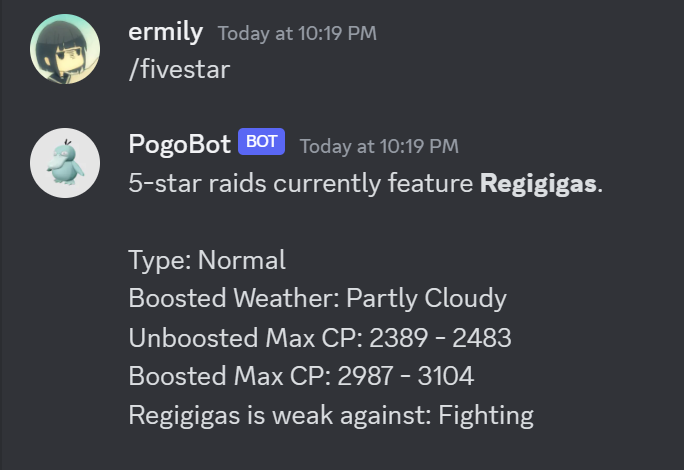

# PogoBot
A discord bot that gives updates about the current and upcoming events in the Pokemon Go app.

## How to Use
- `/showcase` to get info about the current showcase
- `/fivestar` to get info about the current five-star raid boss
- `/help` to get a full list of the PogoBot commands!

## Currently Working On...
A quiz feature to test your pokemon knowledge! Can be played solo or with friends. In the future will be able to adjust difficulty
of quiz questions, and maybe (hopefully) utilize machine learning account and nlp to account for typos and give similar answer choices for
multiple choice questions!

## Backstory

### Why PogoBot?
I enjoy playing Pokemon Go in my spare time, and it's especially fun playing with friends. Although there are many online resources
that give Pokemon Go info about updates, I wanted to find a way to streamline and simplify the info-gathering process. This discord bot was made
to fulfill this purpose. 

### How PogoBot was Made
- The **discord.py API** (python) was used to create the pogobot.
- **BeautifulSoup** was used to scrape information off of the **leekduck.com** website.
- **JSON** was used in tangent with **Pogo API** to get information about raid bosses and type effectiveness.

### Lessons Learned
I ran into many issues surrounding repeatability and modularization.
There were many processes that I coded, and then copy and pasted whenever I needed to reuse that code.

This eventually made it really inconveneint whenever I had to make changes, since I had
to adapt the changes to all the instances of that process. 

Eventually I modularized my code by breaking up small tasks into functions 
that I could then easily edit and reuse. However, if I had done this from the get-go
I would've saved a lot of time and headache. In the future I'll be more careful with
setting up my code to modularize the repeated processes so my code will be more scalable. 
